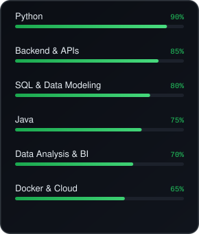
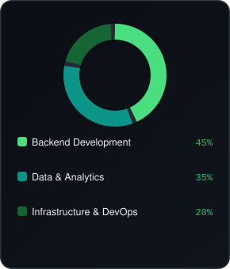
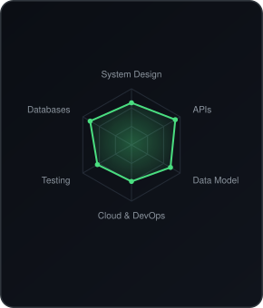

  <a href="#stack">Stack</a> &#183;
  <a href="#projects">Projects</a> &#183;
  <a href="#about">About</a> &#183;
  <a href="#contact">Contact</a>

Every system I build starts with the same question: how do we turn raw data into a decision someone can trust?

I work on the backend side of that pipeline — designing APIs, modeling data, and building the infrastructure that lets teams manage and analyze information without second-guessing it.

## About

Backend developer with a strong focus on Python and Java, combining software engineering with data management and analysis to help turn raw information into decisions the business can rely on.

Currently building projects end-to-end — from data modeling to API design — while growing deeper into cloud and data engineering tooling.

## Stack

**Backend:** Python &#183; Java &#183; Node.js &#183; FastAPI &#183; Django &#183; Spring Boot &#183; REST APIs

**Data:** SQL &#183; PostgreSQL &#183; MySQL &#183; Pandas &#183; Power BI &#183; Apache Airflow

**Infrastructure & Tools:** Docker &#183; Git &#183; GitHub &#183; AWS &#183; Linux &#183; CI/CD

  
  
  

## Projects

Pinned projects are on their way — this section will showcase backend and data projects as they go live.

## Contact

  
  &nbsp;
  
  &nbsp;
  

